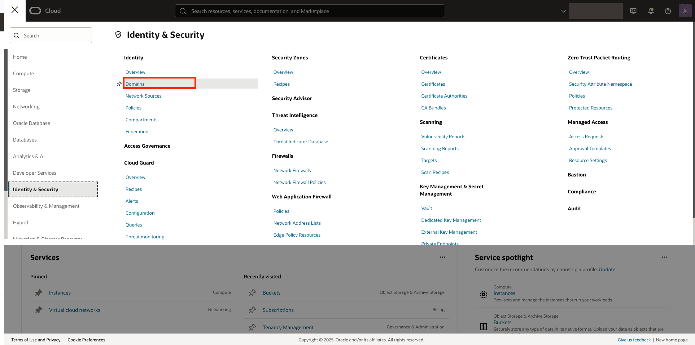
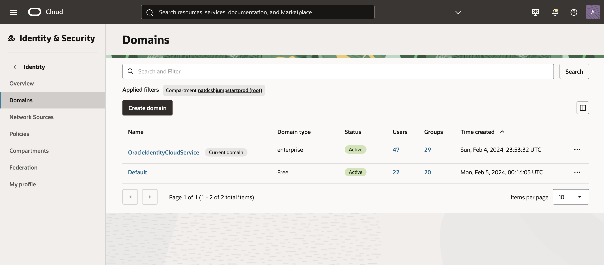
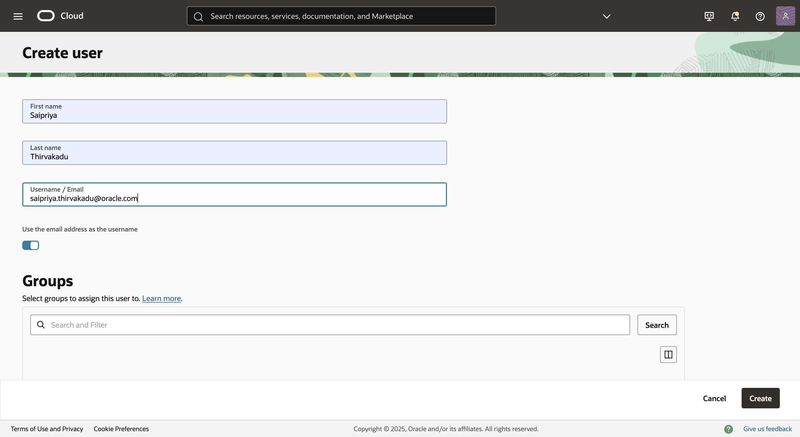
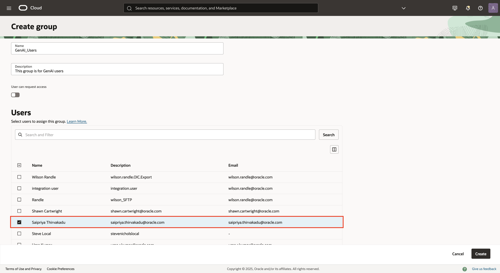
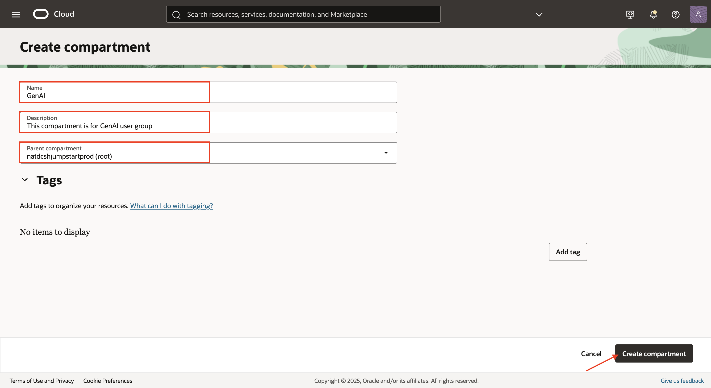
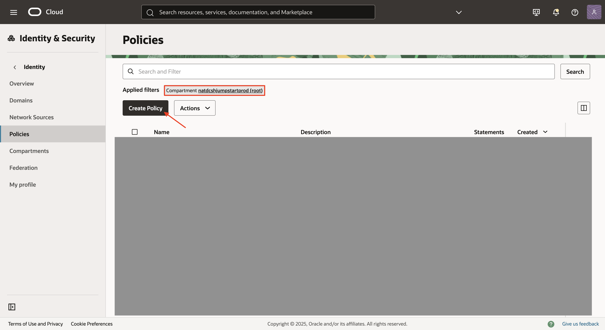
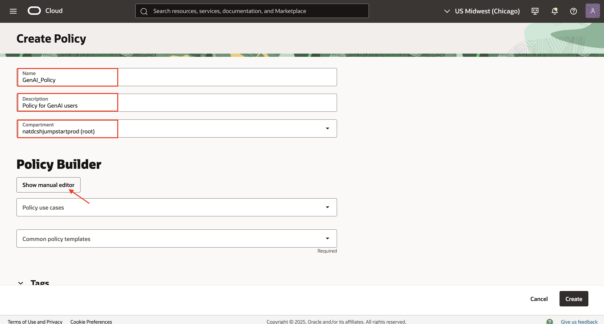

# Configure your OCI Tenancy for GenAI

## **Introduction**

Generative AI is a fully managed Oracle Cloud Infrastructure service that provides a set of state-of-the-art, customizable large language models (LLMs) that cover a wide range of use cases, including chat, text generation, summarization, and creating text embeddings. 

This lab will walk you through the step by step process to configure your OCI tenancy for the GenAI service.

_Note: Preferred to switch to *us-chicago-1* region._

Estimated Time: 10 mins

## **Create a user** - optional

1. For creating a user account for a user in an OCI IAM identity domain, navigate to *Domains* under *Identity and Security*.
    

2. On the Domains list page, select the domain for which you want to create a user. 
    

3. Switch to your domain and create a user under *User management* section.
    

## **Create a group and add the user to the group** - optional

1. Under *Groups* select Create group. In the Name and Description fields of the Create group page, enter the name of and descriptive information about the group.

2. To add users to the group while creating the group, select the checkbox for each user that you want to add to the group.

    

## **Create a compartment** - optional

1. Open the navigation menu  and select *Identity & Security*. Under *Identity*, select *Compartments*. A list of the compartments you have access to in the tenancy is displayed.

2. Click *Create compartment* button. Enter the name, description and pick the parent compartment. Now select *Create compartment*.

    


## **Configure the policies**

1. Open the navigation menu  and select *Identity & Security*. Under *Identity*, select *Policies*. Select the *root compartment*. 

    

2. Enter the name, description and switch to manual editor to type your policy.

    

3. To get access to *all Generative AI resources* in your compartment and allow users to add fine-tuning training datasets to *Object Storage buckets*, use the following policy:

```
<copy>
allow group GenAI_Users to manage genai-agent-family in compartment GenAI
allow group GenAI_Users to manage object-family in compartment GenAI
</copy>
```

_Note: Here is the link of [policies](https://docs.oracle.com/en-us/iaas/Content/generative-ai-agents/iam-policies.htm) that you can review and update permissions at a granular level._ 

## **Summary**

This completes the pre-requisites. 

You may now *proceed to the next lab*.

## **Acknowledgements**

 - **Author** -  Saipriya Thirvakadu | Principal Cloud Architect 
 - **Contributors** - Saipriya Thirvakadu | Principal Cloud Architect 
 - **Last Updated By/Date** - Saipriya Thirvakadu | Principal Cloud Architect, October 2025 

