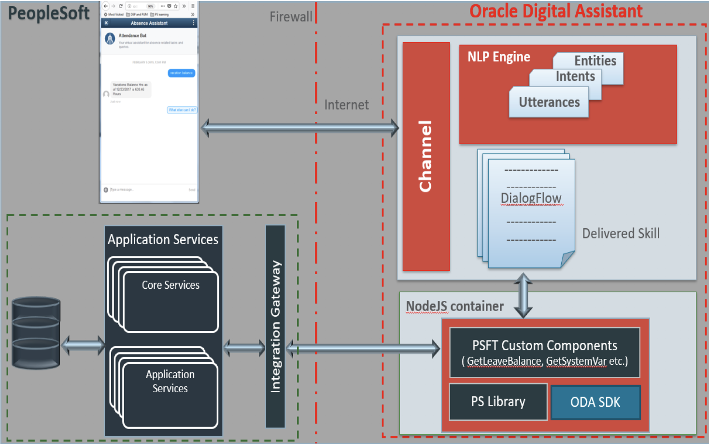
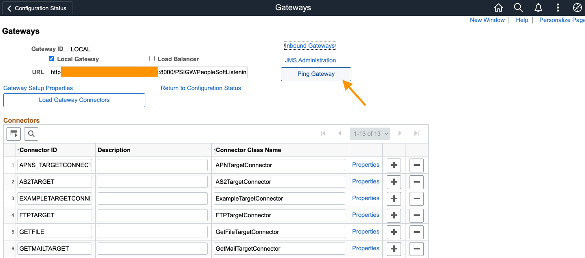
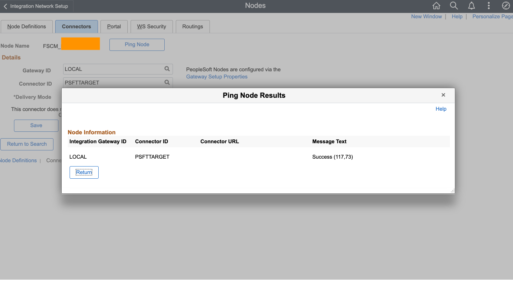

# Configure Requisition bot on PeopleSoft

## **Introduction**

This tutorial describes the process to deploy a Requisition Chatbot on PeopleSoft Financials and Supply Chain Management (Version - 9.2.038, Image: PeopleSoft FSCM 9.2 Update Image 38)  from Oracle Cloud Infrastructure Marketplace instance and Oracle Digital Assistant 20.09. 

Here is the high level overview of the PeopleSoft Chatbot Integration with Oracle Digital Assistant:

The Oracle Digital Assistant is a cloud solution provided by Oracle and connectivity must be ensured through the firewall to enable Integration with on premise PeopleSoft Instances.

**Chat Client**: The Chatbot Integration Framework supports Web Channel and Twilio Channel as a part of Integration with ODA. Chat client rendered within PeopleSoft PIA page establishes connection with Skills through the Web channel. ODA provides a set of Javascript files named as WebSDK, which takes care of construction of Chat Client within PeopleSoft PIA and websocket connection with the chatbot Server. 

The pages/components where the chat client is rendered are configurable through setup pages available under Enterprise Components. For older version of ODA (on or before 19.4) the WebSDK files have to be deployed manually in the webserver under site name "external" (please refer PeopleBooks for additional documents on site creation.) When it comes to Twilio channel, the users sends message directly to the Skill's designated Twilio number.

The communication between PeopleSoft chat client and ODA instance is established using the WebSDK files provided by ODA. The WebSDK is a set of JavaScript and other related files that needs to be deployed on the PeopleSoft Webserver. For deploying the files, a new site named “external” needs to be created (please refer PeopleBooks for additional documentation).

**Skill**: This refers to the actual bot deployed on ODA instance. This contains the different Intents, Utterances and Dialogflow for the bot. The conversion between the user and bot is designed and defined in the skill. Please refer the ODA documentation for more details.

**PSFT Custom Components**: This is the Node JS code to be deployed in the embedded Node JS container in ODA. The custom components are local to a skill within ODA. Two different skills in ODA with the same code deployed in them will run as two separate instances. The PeopleSoft delivered Skills and Skill Template comes with a packaged custom components code. The instructions on how to add/generate custom components for a newly added service is provided later in this document. The delivered custom component library and the package contains security logic and additional methods to facilitate ODA to PeopleSoft Application Service communication.

**Application Services**: Application Service framework is delivered as part of Integration Broker in PeopleTools 8.57. The Chatbot Integration Framework requires the application logic to be developed in application classes and deployed using this framework.

Minimum Requirements: PeopleTools version: 8.57.07, FSCM PeopleSoft MarketPlace image: 9.2.035 

Estimated Time: 2 hours

## **Deploying PeopleSoft Applications on Oracle Cloud Infrastructure Instances**

Follow the below document to deploy the PeopleSoft Marketplace image on Oracle Cloud Infrastructure Compute Instance:

[Deploying PeopleSoft Applications on Oracle Cloud Infrastructure Instances](https://www.oracle.com/webfolder/technetwork/tutorials/obe/cloud/compute-iaas/deploy\_psft\_app\_marketplace\_oci/deploy-psft-marketplace-oracle-cloud-infrastructure.html#overview)

*Note: Select PeopleSoft FSCM Update Image Demo version 9.2.038 from Marketplace for the purpose of this lab. Also, you can skip the following steps from the document: Verifying the Elastic Search Initialization and Enabling Kibana*

## **Assumptions**

1. PeopleSoft Application Service is accessible on the open internet for the ODA Cloud instance to consume.
2. PeopleSoft holds a certificate signed by a valid CA and not a self-signed certificate if you are using SSL based authentication.
3. A user to authenticate PeopleSoft web services “PSFTPROXY” is created. Administrator may use appropriate user id and password based on your preference.
4. Integration Broker is configured, up and running.

## **Verify whether the Integration Broker is active and the Node is responding**

1. Navigate to PeopleTools > Integration Broker > Integration Network > Configuration Status and select Gateway Configured.

2. On the next screen, select Ping Gateway button to check whether the gateway is active.

    

3. Now, go back to the Configuration Status page and select Node Network configured.

4. Next screen shows the list of Nodes available. You can select your nodename with the prefix FSCM_XXXX.

5. Switch to the Connectors tab and select Ping Node button corresponding to your Node name to check whether the Node is responding.

    

## **Troubleshooting Guide**

Follow the link to troubleshoot errors (Page #27): [link](./PeopleSoftChatBot_Install_Guide_for_ODA_version_19.10_and_above.pdf)

## **Summary**

This completes the pre-requisites. 

You may now *proceed to the next lab*.

## **Acknowledgements**

 - **Author** -  Saipriya Thirvakadu | Cloud Engineer 
 - **Contributors** - Max Grossman | Cloud Engineer, Mukul Bihari Prasad | Principal Solutions Architect
 - **Last Updated By/Date** - Saipriya Thirvakadu, Cloud Engineer, January 2021

## See an issue?
Please submit feedback to codeinnovate\_us\_grp@oracle.com. Please include the *workshop name*, *lab* and *step* in your request.  